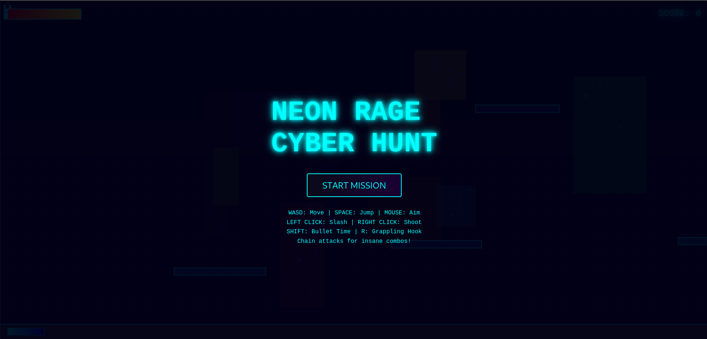
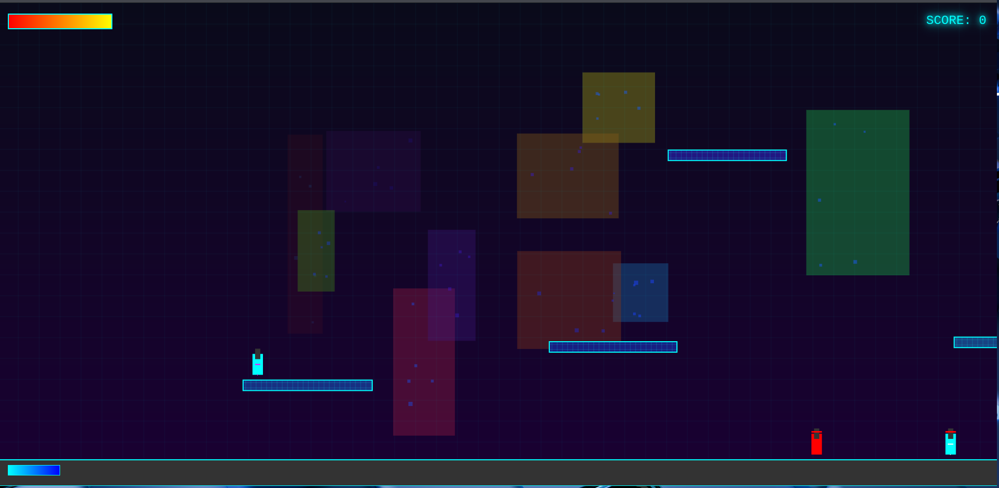

# ⚡ NEON RAGE: CYBER HUNT

> **Gift Edition** 🎁 — A high-octane cyberpunk action game packed with **parkour**, **dual combat styles**, and **epic boss battles**.  
> Fully playable as a **PWA** — install it on your phone or play offline anywhere!  
> 🌐 **Live Demo:** [Play Now](https://neon-rage-cyber-hunt.onrender.com)

---

## 🎮 Game Overview

**Neon Rage: Cyber Hunt** throws you into a neon-lit dystopian city overrun by drones, cyber-ninjas, and towering mechs.  
You are a rogue cyber-assassin armed with a **high-tech blade** and **dual blasters**, capable of running on walls, grappling between rooftops, and bending time itself.  

Your mission: survive endless waves of enemies, chain insane combos, and defeat colossal bosses to climb the leaderboard.  
Every fight is fast, cinematic, and unforgiving — just the way action should be.

---

## 📸 Screenshots

### 🖼️ Cover Art


### 🔥 In-Game Action


---

## 🚀 Features

- **⚔️ Dual Combat System** – Switch instantly between **melee swordplay** and **ranged gunplay**.
- **🤸 Parkour Freedom** – Wall-running, wall-sliding, and grappling hook traversal.
- **⏳ Bullet Time** – Slow down time for perfect shots and epic cinematic moments.
- **👹 Epic Boss Battles** – Multi-phase cyber-mechs with rockets, lasers, and adaptive AI.
- **🎯 Combo Multiplier** – Chain attacks to boost your damage and score.
- **📱 PWA Ready** – Install on mobile or desktop, works **100% offline**.
- **💎 Gift Customization** – Hidden Easter eggs & skins just for the gifted player.

---

## 🎯 How to Play

### 🖥️ PC Controls
| Action            | Key(s) |
|-------------------|--------|
| Move              | `W A S D` / Arrow Keys |
| Jump              | `SPACE` or `W` / `ArrowUp` |
| Sword Attack      | Left Click |
| Shoot Blasters    | Right Click |
| Bullet Time       | `SHIFT` |
| Grappling Hook    | `R` |

### 📱 Mobile Controls
- On-screen **D-Pad** for movement.
- On-screen buttons for Jump, Sword Attack, Shooting, and Bullet Time.
- Grappling Hook is not available on mobile (optional feature).

---

## 🕹️ Gameplay Mechanics (Detailed)

- **Melee Combat**: Deals high damage up close. Every hit increases your **combo count** → more damage per strike.
- **Ranged Combat**: Fire blaster shots toward your cursor/touch point. Great for drones & ranged enemies.
- **Bullet Time**: Activates a slow-motion effect for precision kills. Has a **cooldown** and limited duration.
- **Parkour**: Wall-sliding slows your fall, allowing for wall jumps and creative movement.
- **Grappling Hook**: Instantly pull yourself to platforms or escape danger (PC only).
- **Boss Fights**: Each boss has multiple attack patterns — dodge missiles, avoid sweeping lasers, and strike when they’re vulnerable.
- **Pickups**: Defeated enemies may drop health pickups. Small heals (+10) or large heals (+30).

---

## 📦 Installation & Running Locally

1. **Clone the repository**  
   ```bash
   git clone https://github.com/yourusername/neon-rage-cyber-hunt.git
   cd neon-rage-cyber-hunt
   ```

2. **Run locally**  
   Simply open `a.html` in your browser, or serve it via a local web server:
   ```bash
   python3 -m http.server 8080
   ```

3. **Install as a PWA**  
   - Open in Chrome or Edge.  
   - Click **Install App** (icon in address bar).  
   - Enjoy **offline play**!

---

## 🛠️ Tech Stack

- **HTML5 Canvas** – Rendering the action.
- **JavaScript (Vanilla)** – Game logic, physics, AI, and effects.
- **CSS3** – Styling & responsive layout.
- **PWA Support** – `manifest.json` + `sw.js` for offline capabilities.

---

## 💡 Tips & Tricks

- **Build Combos** – Start with sword strikes, switch to blasters for finishing blows.
- **Save Bullet Time** – Use it for boss weak points or when overwhelmed.
- **Master Parkour** – Wall jumps and grapples can save your life.
- **Watch Enemy Patterns** – Bosses telegraph their most dangerous moves.

---

## 🎁 Gift Edition Special

This game includes **custom messages, skins, and hidden easter eggs** only for the gifted player.  
Look carefully — you might find your name glowing on your armor.

---

## 📜 License

This project is provided as a personal gift. Redistribution is allowed for non-commercial use.

---

🔥 **Step into the neon streets. The hunt begins.**  
[▶ Play Now](https://neon-rage-cyber-hunt.onrender.com)
